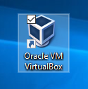
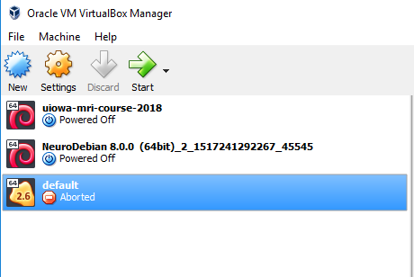
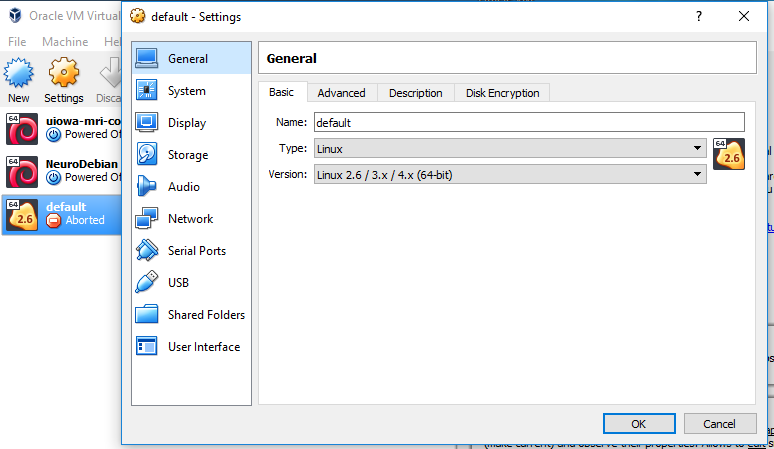
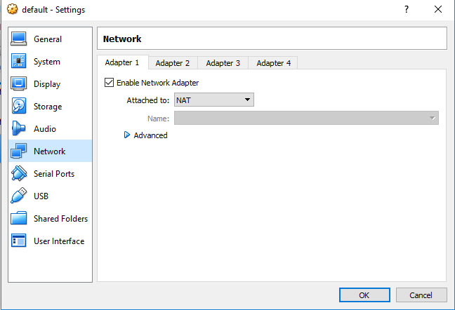
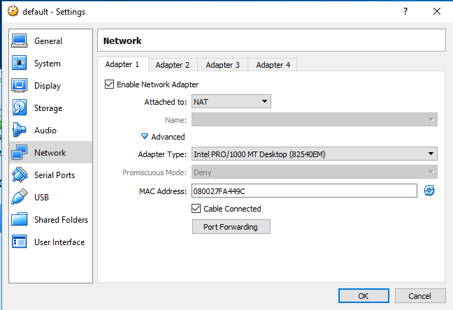
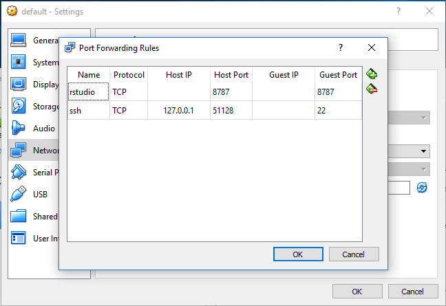

# Docker Tutorial

## [Video of the teaching session](https://www.youtube.com/watch?v=mXT0HXu4uQY&list=PLXFuA4Ik1nXeeNPLEYZgMSMi5CDwwvRn7&index=4&t=75s)

## [Intro To Containers](http://www.repronim.org/coco2019-training/presentations/containers/presentation/#1)


## Installation

- [Docker Desktop](https://docs.docker.com/v17.12/install/#desktop) (if your computer/operating system is newish and is enterprise or business edition for windows)

- [Docker Toolbox](https://docs.docker.com/toolbox/) (if you computer/operating system is not compatible with Docker Desktop)

### Test Installation

With the docker quickstart terminal or a normal terminal, type:
`docker run hello-world`

### Additional Setup For Docker Toolbox

If you've installed Docker Desktop, you are fine, but if you installed Docker Toolbox, read on.
We are going to be working through the browser with rstudio today and so we need to do some extra steps to allow docker to communicate with the browser.

1. Once you've already installed and started docker and made sure it works,
   we will find the virtualbox application. \


2. Once virtualbox is open, select the "default" box and make sure it is shut down, or otherwise not running. \


3. Click the gear icon named settings. \


4. Select Network on the sidebar. \


5. Click the triangle by "advanced" to expand options. \


6. Select the port forwarding option and place the port numbers `8787` in both the host port and guest port.
Name the connection `rstudio`. \


7. Click on the quickstart terminal again to restart docker.
Now you are ready to get started!

## Hands on Exercise

run the docker image without _explicitly_ downloading anything

Docker Desktop (Windows/Mac) or Docker native (Linux):

```bash
docker run --rm -p 127.0.0.1:8787:8787 -e PASSWORD=uibh jdkent/tut-rstudio
```

Docker Toolbox:

```bash
docker run --rm -p 192.168.99.100:8787:8787 -e PASSWORD=uibh jdkent/tut-rstudio
```

If you want to persistently change files, you will have to `clone` the repository where
the data came from.

```bash
git clone https://github.com/jdkent/tutDockerRstudio.git
cd tutDockerRstudio
```

Docker Desktop (Windows/Mac) or Docker native (Linux):

```bash
docker run --rm -p 127.0.0.1:8787:8787 -e PASSWORD=uibh -v ${PWD}:/home/rstudio/project jdkent/tut-rstudio
```

Docker Toolbox:

```bash
docker run --rm -p 192.168.99.100:8787:8787 -e PASSWORD=uibh -v ${PWD}:/home/rstudio/project jdkent/tut-rstudio
```
